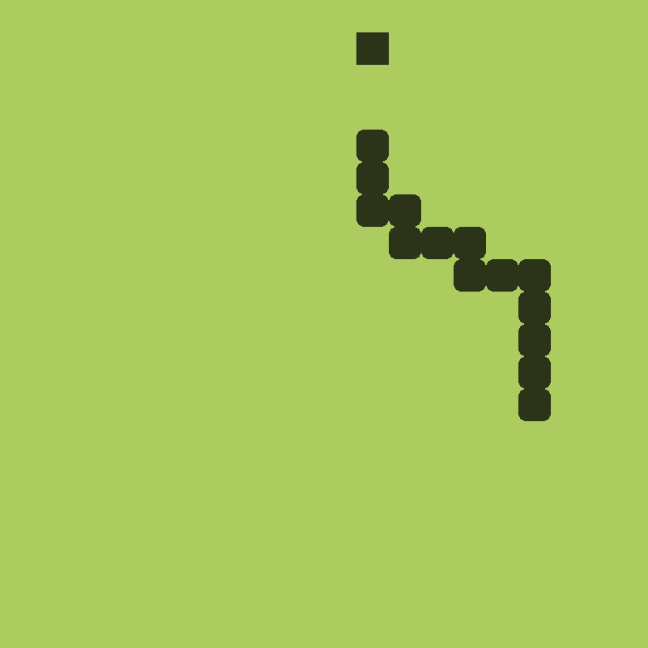

# Snake Game in DLang

This is a simple Snake game built with the [D programming language](https://dlang.org/) using [raylib](https://github.com/raysan5/raylib). The project was created as an exercise to explore and experiment with DLang and was not developed with the primary intention of making a fully polished game.

## Prerequisites
Before building and running the game, make sure you have the following installed:
- [DMD](https://dlang.org/download.html) with the **MSVC** option on **Windows**: Required to compile the D source code.
- [Python](https://www.python.org/downloads/): Required for the build system and third party installations.

## Installation
1. [Clone](https://github.com/q4niel/SnakeD.git) or [Download](https://github.com/q4niel/SnakeD/archive/refs/heads/main.zip) the repository

2. Install third party assets:
    - **Windows**: Run ***third/install.bat***
    - **Linux**: Run ***third/install.sh***

3. Build the game:
    - **Windows**: Run ***build/build.bat***
    - **Linux**: Run ***build/build.sh***

4. Run the game:
    The compiled binary will be placed within ***build/out***

## Controls
- **ESC** for closing the game
- **Arrow Keys** to move the snake